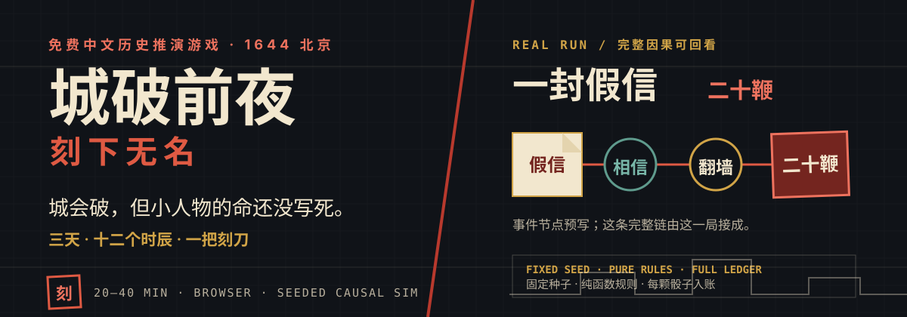
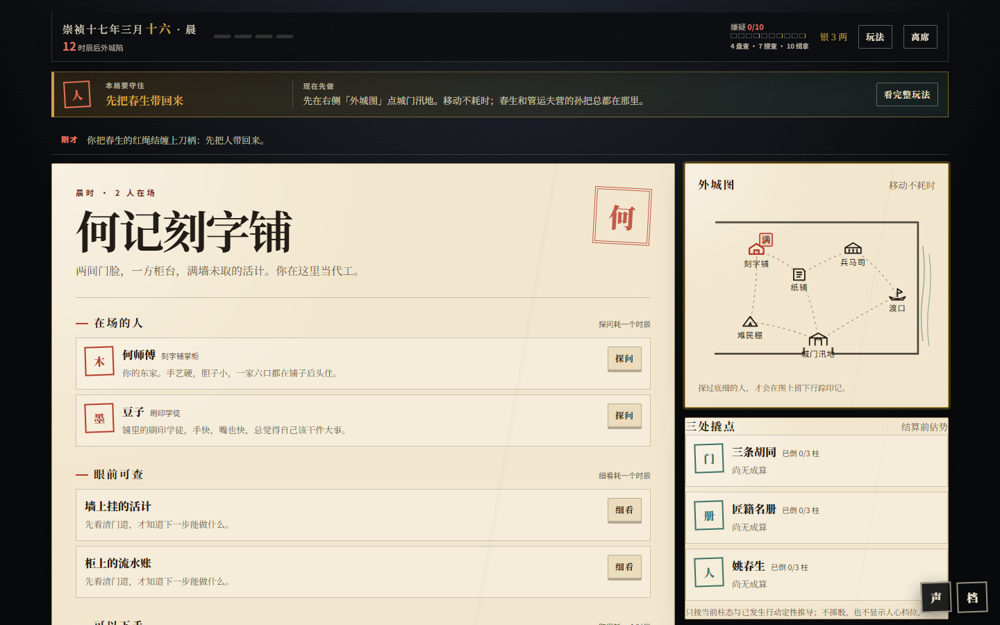
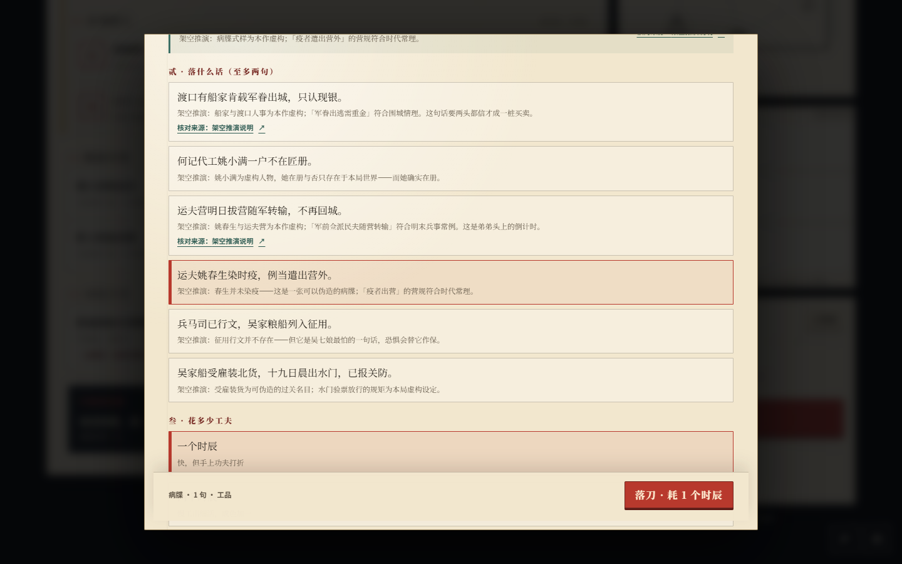
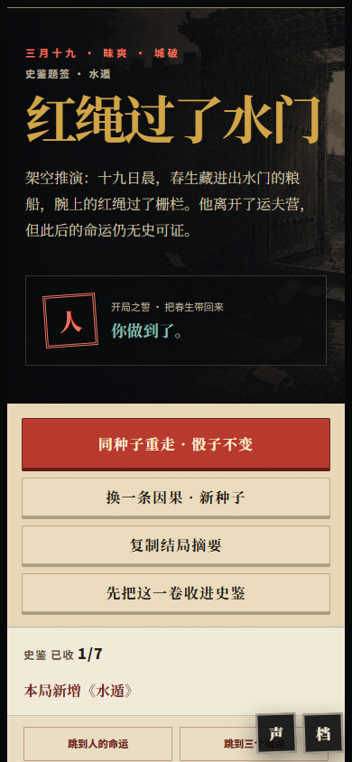

<p align="center">
  
</p>

<p align="center">
  <strong><a href="https://mckf111.github.io/if-history/">▶ 现在进城</a></strong>
  · <a href="#一局怎么走">一局怎么走</a>
  · <a href="#本地运行">本地运行</a>
  · <a href="#史实原创与授权边界">史实与授权</a>
</p>

<p align="center">
  免费 · 无注册 · 无广告 · 不上传存档 · 约 20～40 分钟
</p>

> 崇祯十七年三月，北京。城破已经写进史书，改不了。可史书没有把每个普通人的命都写死。你是宣武门外刻字铺的姚小满，手里没有兵，只有一把刻刀，以及让一张纸被人相信的本事。

## 先看一眼它真正怎么玩

主盘面始终告诉你：还剩多少时辰、这一局想守住什么、现在最值得做什么。走路不耗时；观察、探问和制书会让倒计时继续向前。

<p align="center">
  
</p>

<p align="center">
  
</p>

<p align="center">
  
</p>

工作台不会让你凭空造出命令。纸、印、手迹和一句足以动摇人的话，都要从城里一点点找来；结局则会回答：你做过什么，传到了谁那里，最后有没有真的改变命运。

## 你救不了明朝，但可以争三件事

| 门 | 册 | 人 |
| --- | --- | --- |
| 城门打开时，附近街坊能不能少受一些伤害 | 匠人的名册会不会完整落到征发者手里 | 姚春生能不能从运夫营脱身，坐船离开 |

这不是总分游戏，也不要求一局救下所有人。开局先从“门、册、人”里选一个最放不下的目标；三月十八夜后，系统会按真正发生过的因果追问这句誓愿守住没有。

<p align="center">
  
</p>

## 一局怎么走

1. **立誓。** 选下这一局最想守住的人或事；誓愿只决定终局追问，不暗加数值。
2. **走、看、问。** 在六处地点之间移动，寻找纸料、印记、手迹和人物真正的欲望与恐惧。
3. **刻、改、送。** 回刻字铺制作文书，再把它交给一个真实的人。带信人可能照送、加戏、转卖，甚至昧下。
4. **读夜报，看结局。** 文书经过验看、相信与人物行动，最终撬动“门、册、人”；结局会展开每一步因果和全部判定。

<details>
<summary><strong>卡住时，只看这五句</strong></summary>

- 眼前的东西拿不了：先“细看”，或向相关人物“探问”。
- 工作台什么都做不了：点开一种文书，看清“还缺”什么，再回城里找。
- 没人带信：赵四、豆子或吴七娘必须正好在身边。
- 嫌疑太高：只有回刻字铺躲进阁楼，才会降低嫌疑。
- 做好的文书尽快送出；留在袖中的纸改变不了任何人。

</details>

## 为什么每一步都能追到

- **固定种子。** 一局开始后，所有随机结果只来自存档里的种子；同一种子、同样选择，得到同样结果。
- **纯函数规则。** `SimState` 是唯一权威状态，React 只提交命令，不直接修改人物、信念或结局。
- **完整因果账。** 制书、投递、私心、验看、信念、人物行动、支撑柱与结局可以逐步回放；没有实际骰值时不会伪造骰值。
- **三层编年史。** 终局把“实际发生的事”“被写下的事”“后来流传的事”分开，并为史实骨架提供来源。

游戏没有账号、服务器数据库或运行时人工智能。自动存档与声音都留在浏览器本地；右下角“档”可以抄出或读回经过完整重放校验的 JSON 存档。

## 本地运行

需要 Node.js 20.19～20.x，或 Node.js 22.12 及更高版本。

```powershell
npm install
npm run dev
```

浏览器通常会打开 `http://localhost:5173`。

提交前的完整门槛：

```powershell
npm test
npm run build
npm run audit:public
npm audit
```

当前版本为 **v0.6.0**；单局存档为 **v7**，跨局史鉴为 **v2**。现有自动测试为 **28 个测试文件、137 项**。

## 史实、原创与授权边界

本作把居庸关失守、崇祯十七年三月十八日日晡外城陷、十九日昧爽内城陷及帝崩万岁山作为不可改变的史实骨架。姚小满、其余人物、具体文书、局部撬点与偏转结局均为虚构或架空推演，不冒充真实人物和史料。

- [史实边界与原始资料入口](docs/HISTORICAL-NOTES.md)
- [模拟架构、随机模型与存档边界](docs/ARCHITECTURE.md)
- [最终测评与 v0.5 终修记录](docs/FINAL-EXPERIENCE-REVISION-2026-07-14.md)
- [生成图像资产记录](docs/ART-ASSET-PROVENANCE.md)
- [原创性、授权与可追溯边界](docs/ORIGINALITY-AND-RIGHTS.md)
- [EdgeOne Pages 双端部署与安全边界](docs/DEPLOY-EDGEONE.md)

自 v0.6.0 起，由权利人拥有或有权授权的程序代码、叙事与视觉内容均为**保留所有权利**；官方页面仅授权个人、非商业游玩，完整边界见 [LICENSE](LICENSE) 与 [代码及内容权利说明](LICENSE-CONTENT.md)。v0.5.0 及此前已经取得的副本仍按当时附带的 AGPL-3.0-only 与 CC BY-NC-SA 4.0 条款处理；第三方运行时继续按各自许可证使用，详见 [第三方软件清单](docs/THIRD-PARTY-SOFTWARE.md)。项目标识边界见 [TRADEMARKS.md](TRADEMARKS.md)。

商业发行、联合推广、投资或收购洽谈：**[mckf11111@gmail.com](mailto:mckf11111@gmail.com)**。

<p align="center">
  <a href="https://mckf111.github.io/if-history/"><strong>城会破，但小人物的命还没写死。现在进城 →</strong></a>
</p>

<p align="center">
  Copyright © 2026 mckf111（文虎）
</p>
