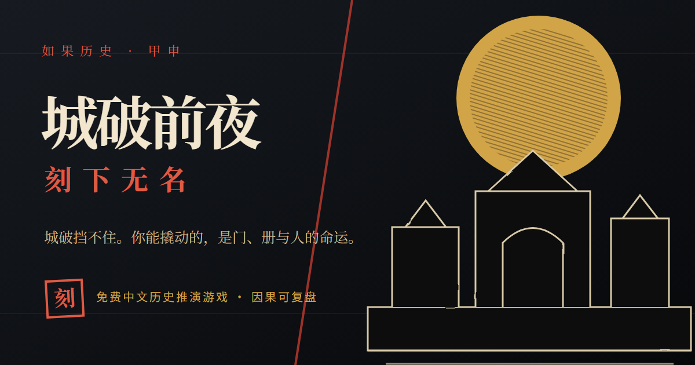

# 城破前夜：刻下无名



> 城会破，但小人物的命还没写死。史书会记下帝王将相，而你手里只有一把刻刀——能不能替几个无名的人，争出另一条活路？

## [现在进城](https://mckf111.github.io/if-history/)

点开就能玩。不用安装，不用注册，也没有付费按钮。

最好给自己留出 **20～40 分钟**。玩到一半要走也没关系，游戏会自己存档，回来还能接着玩。

> 这是一款历史推演游戏。故事会提到战争、死亡和处决，但没有血腥画面。

## 你救不了明朝，但也许能救几个人

崇祯十七年三月，北京。离城破只剩三天。

你叫 **姚小满**，在宣武门外的刻字铺替人做活。你不带兵，也不认识什么大人物。能拿得出手的，只有一把刻刀，还有辨认、制作文书的本事。

城破这件事已经写进史书，改不了。可史书没有把每个普通人的命都写死。三天里，你还能争一争：

- 城门打开时，附近的街坊能不能少受一些伤害；
- 匠人的名册会不会落到抓人的人手里；
- 小满的弟弟春生能不能平安坐船离开。

你的办法听起来不太像英雄故事：去街巷里看，和人说话，凑齐纸、印和笔迹，再刻出一份足以让人相信的文书。

纸不会自己创造奇迹。真正推着事情往前走的，是读到它的人愿不愿意信，又会为了这份相信做什么。

## 第一次来？跟着这条路走

先别被满城的人名和物件吓住。第一局只要记住一条路：逛一逛、仔细看、开口问、做文书、找人送。

### 1. 这一局，你最不想失去什么？

开局点击 **“开始游戏”**，在“人、册、门”里选一个最放不下的目标。

这不是一道加分题，只是你给自己留的一句承诺。到了结局，游戏会把它拿回来问你：做到了吗？

### 2. 先逛一圈，别急着花时辰

点击右边城图上的地点，就能过去。**走路不花时辰**，所以先认认路也无妨。

不方便使用鼠标时，可以按 `Tab` 找到地点，再按 `Enter` 或空格前往。

### 3. 有东西就细看，遇到人就探问

- 点击 **“细看”**：检查眼前的物品；
- 点击 **“探问”**：向在场的人打听消息。

这两件事每次会占一个时辰。换回来的不只是线索：你会慢慢知道东西藏在哪里、谁每天会去哪里，以及一个人真正怕什么、想要什么。

### 4. 缺什么，工作台会告诉你

纸、印章和笔迹样本散落在不同地点。有些可以买，有些需要先观察或打听才能取得。

回到刻字铺，点击 **“上工作台”**。每种文书还缺什么，上面会明明白白写出来，不用靠猜。

### 5. 文书写好了，事情才刚开始

在工作台里只做三件事：

1. 挑一种文书样式；
2. 选一两句话刻进去；
3. 决定花一个还是两个时辰把它做好。

第一张文书做完后，手会熟一档；从第二张起，同样的材料和工时能把文书成色再抬一档。做好后，点击 **“托人送出”**。别把带信人只当成跑腿的：有人会老老实实送到，有人会添油加醋、转手卖掉，甚至干脆把信藏起来。

### 6. 天黑以后，听听城里发生了什么

每天的四个时辰用完，夜就来了。夜报只写街坊能听见的动静，不会替你钻进每个人心里。

到了三月十九日，游戏会把这一局慢慢摊开给你看：

- 你最初的愿望有没有实现；
- 门、名册和春生的命运为什么改变，或者为什么没有改变；
- 每一步选择是怎样传到结局的；
- 事实、当时的记载和百年后的传说有什么不同。

游戏有 **七类正常结局**，还有一种被抓后的失败结局。就算没能救下想救的人，这一局也不会被抹掉——失败同样会留下自己的故事。结局页可以用同一种子重走，让骰子保持不变，也可以换一个新种子另开因果。

## 几个不太常见的词

游戏借了一些旧时叫法。记不住也没关系，随时回来看看。

| 看到的词 | 大白话解释 |
| --- | --- |
| 时辰 | 每天可以做四次费时间的事。走路和当面托信不费时辰。 |
| 嫌疑 | 别人觉得你可疑的程度。到 4 会被盘问，到 7 可能被搜查，到 10 会被抓。 |
| 袖中 | 可以把它当成随身包裹：纸、印、笔迹样本和文书都放在这里。 |
| 人物册 | 你亲自打听到的人物信息和行踪。没打听过的事不会提前告诉你。 |
| 史鉴 | 玩过几局后留下的收藏册，记录发现过的结局、人物和因果。 |
| 种子 | 像是这一局的随机暗号。同一个暗号加上同样的选择，会得到同样的结果。 |

## 要是卡住了

- **眼前的东西拿不了？** 先点击附近的“细看”，或者向相关人物“探问”。
- **工作台里什么都做不了？** 点开一种文书，看看“还缺”后面写了什么，再回城里找。
- **没人愿意带信？** 找赵四、豆子或吴七娘。他们要正好在你身边，才能接过文书。
- **嫌疑太高？** 回刻字铺选择“等一时辰”。只有躲进阁楼，嫌疑才会降下来。
- **不知道信该送给谁？** 想想这句话最能打动谁，又最能吓到谁。
- **时间快用完了？** 做好的文书要尽快送出去。留在袖子里的纸改变不了任何人。

实在不知道先做什么，就记住：**没碰过的事，不会靠运气自己变好。**

## 玩到一半关掉网页，会丢吗？

不会。游戏会自动保存当前这一局。

- 开新局前会先问一声，不会悄悄盖掉旧档；
- 右下角的 **“档”** 可以把当前进度抄成 JSON 文件，也能从首页或游戏中读回；读入前会重放核对全部因果，覆盖当前局时会先确认；
- 如果浏览器拒绝自动存档，页面会持续提醒，不会把失败装成成功；
- 右下角的 **“声”** 可以静音和调音量；环境声与动作声都在本地实时合成；
- 不需要账号，也没有广告、内购或付费内容；
- 游戏运行时不接人工智能，不会把你的选择和存档上传到服务器；
- 存档只留在当前浏览器里。清除浏览器数据时，它也会一起消失。

## 想自己跑起来，或者看看代码

只想玩游戏，看到这里就够了。下面是写给开发者的。

想把项目跑在自己的电脑上，需要 Node.js 20.19～20.x，或 Node.js 22.12 及更高版本。

```powershell
npm install
npm run dev
```

浏览器通常会自动打开 `http://localhost:5173`。

准备提交改动时，跑一遍：

```powershell
npm test
npm run build
npm run audit:public
```

它们会检查游戏规则、生产构建，以及公开页面的标题、说明、分享图、站点地图和权利声明。

还想往里看，可以从这些文档开始：

- [架构与状态机](docs/ARCHITECTURE.md)
- [史实边界与资料来源](docs/HISTORICAL-NOTES.md)
- [生成图像资产记录](docs/ART-ASSET-PROVENANCE.md)
- [对抗式审查整改矩阵](docs/ADVERSARIAL-REVIEW-RESOLUTION-2026-07-13.md)
- [SEO / GEO 公开发布说明](docs/SEO-GEO.md)
- [更新记录](CHANGELOG.md)

仓库当前版本为 **v0.4.0**。单局存档版本为 v6，跨局史鉴版本仍是 v2。v5 旧档原地保留但不迁移，避免用新规则重放后悄悄改写旧结果。

---

## 史实与架空边界

本作只把居庸关失守、崇祯十七年三月十八日日晡外城陷、十九日昧爽内城陷及帝崩万岁山作为不可改动的史实骨架。

姚小满与其余人物、六处游戏地点、具体文书、街巷行动、三个局部撬点及全部偏转结局，均为虚构或架空推演，不宣称为真实人物和真实事件。游戏内的史实陈述提供来源；架空内容明确标注为“架空推演”，不为虚构情节伪造史料。

主要底本入口见 [史实边界与资料来源](docs/HISTORICAL-NOTES.md)。

## 原创、复制与抓取声明

人物、剧情、文书、结局文本、界面构图，以及首页、分享图和三张章节木刻图，均由本项目独立创作、生成或以仓库内代码绘制；声音由浏览器本地实时合成。本项目不使用第三方商业游戏的角色、图像、音乐、商标或叙事文本；古籍原文与公有领域史料不属于本项目原创内容。章节图的生成与处理记录见 [生成图像资产记录](docs/ART-ASSET-PROVENANCE.md)。

公开网页无法从技术上保证“绝不被复制”。本项目通过 Git 提交历史、版权元数据、原创源文件和双轨授权保留可核对的形成记录与维权依据。符合许可证条件的复制与再创作是被允许的；不符合条件的商业使用不因此获得授权。完整说明见 [原创性、授权与可追溯边界](docs/ORIGINALITY-AND-RIGHTS.md)。

本网站允许搜索索引和用户主动访问；不授权 GPTBot 将网站内容用于通用模型训练。`robots.txt` 是对守约抓取方的行为声明，不替代著作权与许可证。

## 授权

本仓库采用双轨授权，完整适用范围见 [LICENSE-CONTENT.md](LICENSE-CONTENT.md)：

- **程序代码**：[AGPL-3.0-only](LICENSE)。复制、修改、分发或以网络服务提供时，必须按同一协议开放完整对应源码。
- **叙事与视觉内容**：[CC BY-NC-SA 4.0](LICENSES/CC-BY-NC-SA-4.0.txt)。复制与改编必须署名，仅限非商业使用，并以相同方式共享。

《明史》《甲申传信录》《大明会典》等公有领域古籍不在上述叙事与视觉内容授权范围内。

版权人保留另行授权，包括商业授权的一切权利。

Copyright © 2026 mckf111（文虎）

[](LICENSE)
[](LICENSE-CONTENT.md)
