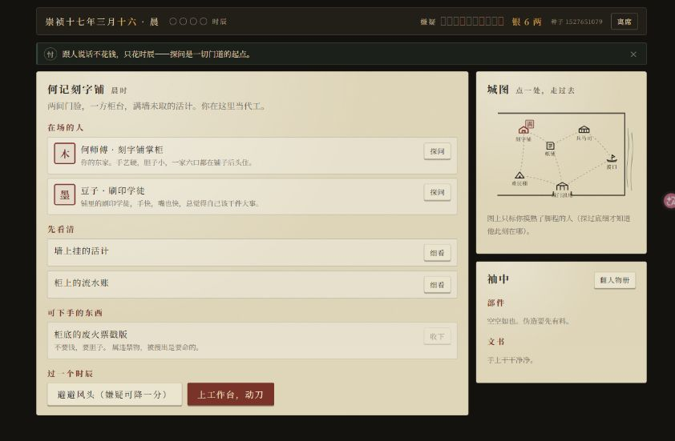
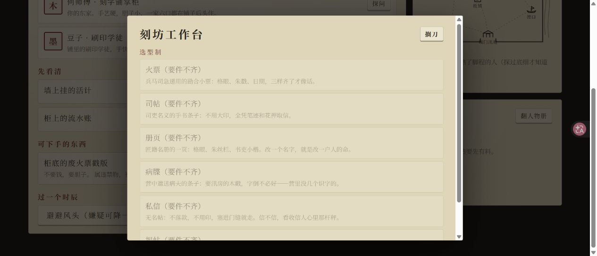
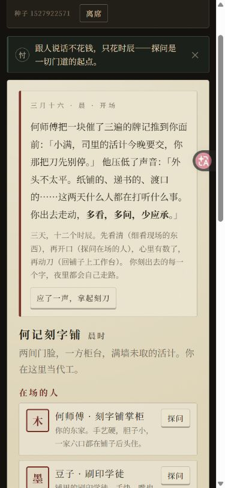
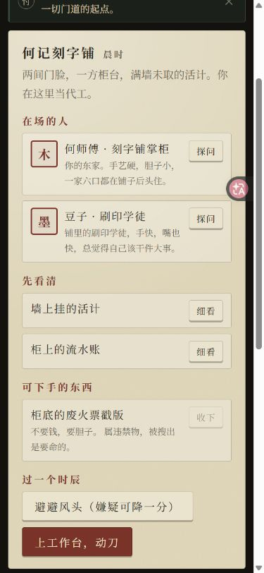

# 《城破前夜》对抗式审查报告

> 审查日期：2026-07-13  
> 审查基线：`main@d0aa619047161d9613a9ddfe1a1c66231538ee2d`  
> 审查范围：`src/sim/` 当前可见主游戏、内容表、存档、史鉴、GitHub Pages 发布链路，以及桌面/移动端主流程  
> 审查方式：三路独立审查（工程与安全、玩法与史料、界面与无障碍）+ 主审交叉复现  
> 本报告只记录问题与证据，没有修改游戏代码。

## 一、结论先行

当前版本可以构建、可以通过现有测试，也能由鼠标用户走完一局；但它还不能可靠兑现 README 中最核心的三项承诺：

1. **“人做的事撬动历史节点”并不总成立。** 即使玩家三天什么都不做，10% 底骰仍可能生成“玩家促成”的人物行动和优先级最高的结果族；反过来，人物已经做出的烧册、烧证等行动又可能被终局骰覆盖。
2. **“因果可复盘”并不成立。** 投书、送达、流言之间的因果边断裂或挂错，终局会把玩家文书的后果归到“夜间时局”；同一夜的流言还会传播两跳，而不是文档承诺的一跳。
3. **“史实给来源、骰值全公开、存档可防篡改”只完成了形状，没有完成语义。** 当前存在史料时刻错配、失效来源、未入账骰子，以及可被重放校验接受的规则外命令。

因此，本次总评是：**黄色偏红，不建议把当前版本视为“因果模型已经可信”的完成态。** 最优先的不是增加内容，而是先让模拟、编年史和玩家看到的叙事说同一件事。

严重度定义：

- **P1｜发布阻塞**：破坏核心玩法或历史可信度，或直接阻断一类用户完成核心任务。
- **P2｜重要**：可导致死档、崩溃、明显误导或较大测试盲区，但触发面较窄。
- **P3｜一般**：不阻断流程，但损伤理解、可用性或维护安全边界。

## 二、问题总表

| 编号 | 严重度 | 状态 | 结论 |
|---|---|---|---|
| F01 | P1 | 已复现 | 零行动也可能生成“玩家促成”的撬点与最高优先级结果族 |
| F02 | P1 | 已复现 | 人物自主行动与节点结算脱钩，已发生的烧册/烧证可被后续规则否认 |
| F03 | P1 | 已复现 | 标称“一跳”的流言会在同一夜传播两跳，且受人物数组顺序影响 |
| F04 | P1 | 已复现 | 因果账在投书、送达、流言处断链，无法回溯真实玩家行为 |
| F05 | P1 | 已复现 | 编年史会写错日期、地点、罪名，或漏掉实际撬动的节点 |
| F06 | P1 | 已复现 | “重放防篡改”接受负时辰、重复断言和不存在地点等规则外命令 |
| F07 | P1 | 已复现 | 已消耗、被没收或被人物烧掉的“一次性部件”可以再次取得 |
| F08 | P1 | 原始来源核对 | 史实骨架存在时刻错配，配置来源另有失效与断言粒度不足 |
| F09 | P1 | 已复现 | 城图六个地点全部不能用键盘聚焦和触发，核心移动被阻断 |
| F10 | P1 | 已复现 | 模态面板失去焦点边界；时辰、嫌疑等关键状态没有可访问数值 |
| F11 | P2 | 已复现 | 带信人未起私心的骰子消耗了随机状态，却没有进入因果账 |
| F12 | P2 | 已复现 | 免费移动 400 次可把仍在进行的合法存档锁死 |
| F13 | P2 | 已复现 | 史鉴浅校验会接受随后必然崩溃的数据 |
| F14 | P2 | 已确认 | `legalCommands` 不是完整命令集，添改不可达，随机漫游漏测关键路径 |
| F15 | P2 | 已复现 | 移动端换屏保留旧滚动位置，开局即把日期、时辰和嫌疑推离视口 |
| F16 | P2 | 已确认 | 工作台初次进入像死路；提示和“避风头”文案还会误导操作 |
| F17 | P2 | 已确认 | 玩家界面不能点开史源，编年史构建还丢弃模板来源 ID |
| F18 | P2 | 风险 | 构建任务继承发布权限、动作未锁提交，且主分支没有合并前检查 |
| F19 | P2 | 已复现 | 小号灰字对比不足；终局下一步按钮埋在约三屏之后 |
| F20 | P2 | 设计风险 | 修复一次性采集后，春生三柱的直接路线可能被封；现有“可达”测试绕开资源链 |
| F21 | P3 | 已确认 | 新局会直接清掉旧存档；未投递文书预览日期固定为三月十八 |

## 三、P1 详细证据

### F01｜零行动也能生成“玩家促成”的最高优先级结果族

`src/sim/engine/node.ts:48-52` 让三个撬点都从 10% 起步；`node.ts:95-107` 只要骰中，就采用 `tipped` 文案并把操作者固定记为 `player`，不检查是否倒过任何柱子。

合法复现：种子 `1972`，三天内只休息并确认晨报。

```text
九根柱：全部仍立，且没有上游因果
门：10%，骰 1，成功
春生：10%，骰 7，成功
结果族：全门之约
事实层：孙把总撤拒马、与坊老订约；春生乘船逃走
```

顺序扫描 100 万个种子，全程不行动时约 **27.09%** 至少有一个撬点自行成功，约 **1.00%** 进入要求“门 + 春生”都成功的“全门之约”。随机底骰本身可以是设计选择；缺陷在于**没人相信、没人行动时，系统仍补写完整人物行为并归功于玩家**。

建议验收条件：10% 底骰成功必须采用不居功的随机/历史偶然文案，`actor` 不得写成玩家；或者底骰只允许决定“未干预历史如何发展”，不得伪造人物已经执行的具体动作。

### F02｜人物行动与世界结算脱钩

自主行动在 `src/sim/engine/propagate.ts:222-263` 主要写入旗标、好恶、嫌疑；节点结算 `src/sim/engine/node.ts:32-52` 重新读取的却只是人物信念。10 个行动旗标中，只有 `douzi-printed-names` 被一条编年史模板消费；`bonds` 目前只写不读。

两条已复现矛盾：

- 种子 `3`：夜话明确说“钱司吏往灶膛塞了几页纸”，但名册节点随后因 35% 对骰 78 失败，事实层又写“匠籍名册完整移交”。
- 种子 `2`：何师傅夜里“连柜底都掏了”“官面部件从此难寻”，次日玩家仍能从柜底收走同一枚废火票戳版。相关内容在 `src/sim/content/npcActions.ts:45-51`，采集规则在 `src/sim/engine/actions.ts:131-166`。

这直接违背 README 第 11、80 行“相信 → 行动 → 撬动节点”“人物刻画是承重墙”的产品定义。

建议验收条件：每个改变世界的行动必须产生节点或场景能读取的状态；已烧毁/转移的物件不能再出现；节点结果必须尊重已经发生的确定行动。

### F03｜“一跳”流言同夜传播两跳

`src/sim/engine/propagate.ts:173-204` 在遍历人物时，一边从不断变化的 `working` 读取信念，一边把新信念立即写回同一对象。排在后面的人会把本夜刚听到的消息继续传出去。

复现之一：让何师傅对某条 `rumor/logistics`（传言/物流）断言达到三级后只跑一次夜间结算。

```text
何师傅 → 赵四：0 → 2（直接邻居）
赵四   → 孙把总：0 → 1（同一夜第二跳）
```

另一独立复现从吴七娘开始，也出现“吴七娘 → 春生 → 孙把总”的同夜二跳。README 第 20 行、`docs/ARCHITECTURE.md:12` 和代码注释都明确写的是“一跳”。

建议验收条件：传播源必须读取夜初快照；新增信念只能在下一夜成为新的传播源。增加“所有非直邻本夜不变”的回归测试，并打乱人物数组顺序验证结果不变。

### F04｜因果账不能追到玩家投出的文书

投书账目在 `src/sim/engine/forge.ts:191` 没有原因；普通送达在 `src/sim/engine/propagate.ts:62,146-156` 指向夜间时局或带信人私心，而不是投书；流言信念在 `propagate.ts:192-198` 也只指向夜间时局，而不指向真实上游人物信念。

合法流程的实际账链如下：

```text
伪造 a2（无原因）
投书 a3（无原因）

夜间时局 a6
  → 带信人加戏 a7
    → 送达 a9
      → 验看 a10
        → 何师傅信念 a11

夜间时局 a6
  → 赵四听到何师傅传言 a13
```

玩家的 `a2/a3` 成了孤岛。现有随机漫游只检查 `causeId` 能否解引用，没有检查“原因是否真的是原因”。终局界面还只展示第一个原因，进一步隐藏多因关系。

建议验收条件：至少形成 `forge → dispatch → transit/betray → inspect → belief → action → pillar → lever → chronicle` 的可追踪链；流言信念应指向来源人物最近一条对应信念账。

### F05｜编年史与本局真实状态互相矛盾

已确认三类错误：

1. `src/sim/content/chronicleTemplates.ts:69-79` 把处决日期写死为“三月十七”，并固定写“两日后城破”。合法路径可在三月十八触发缉拿，此时实际只隔一天。
2. `src/sim/engine/suspicion.ts:60-81` 固定写“踹开阁楼”“私刻印信”；即使玩家在兵马司、没有造过文书、没有任何印信部件，也会得到同一罪名和地点。
3. `chronicleTemplates.ts:19-33` 的“门成功”模板只属于 `quan-men`，而 `luan-ye` 的门模板又要求门失败。种子 `1973` 全程休息可得到 `gate=true, family=luan-ye`，最终事实层完全漏掉门已撬动。

建议验收条件：所有事实层文案从终态和审计账派生；为日期、地点、罪名以及 `3 个撬点 × 结果族` 的组合做覆盖测试，禁止无模板静默漏项。

### F06｜规则外命令能够通过“重放防篡改”

`src/sim/engine/validate.ts:240-255` 只验证命令名，再用同一套宽松引擎重放；它没有逐类验证字段类型、取值、重复项和多余字段。引擎随后直接信任这些字段。

最短复现：

```ts
applyCommand(createSim(1), {
  t: 'forge',
  templateId: 'dt-huopiao',
  claimIds: ['c-pay-coming'],
  partIds: [],
  effortSlots: -100,
})
```

结果是无部件造出文书、`slot === -100`，序列化后仍满足 `validateSimState(...) === true`。另一个复现 `{ t: 'move', to: 'toString' }` 会利用普通对象的原型属性通过 `src/sim/engine/actions.ts:58`，把地点写成 `toString`，校验仍接受。重复断言也会被多次应用。

边界：这是本地单机存档的完整性缺陷，**不是远程代码执行或服务器安全漏洞**。

建议验收条件：为每种命令建立严格的判别联合校验；地点和内容 ID 用自有属性检查；数值只接受规则枚举；重放前拒绝重复 ID 和未知字段。

### F07｜“一次性部件”能被重复取得

`src/sim/types.ts:302` 明确说部件均为一次性获取，但 `src/sim/engine/actions.ts:131-166` 只检查它此刻是否还在背包。纸张在造文书后会被消耗，违禁部件会被搜查没收，于是原采集点再次开放。

已复现：

- 取毛边纸 → 造文书消耗 → 回纸铺 → 同一采集条目再次出现并成功收取。
- 种子 `2654435761`：搜查没收废火票戳版 → 第三天回铺 → 同一枚戳版再次收取；七点搜查阈值已触发过，不会再次搜查。
- F02 中何师傅已经“烧尽证据”后，同一戳版仍可取得。

建议验收条件：另存跨背包生命周期的 `collectedIds/removedWorldItems`；消耗、没收、烧毁都不能让唯一世界物件重生。

### F08｜史实与来源链存在实质缺口

本项只依据仓库自己指定的原始来源判断，不以搜索优化文章或营销内容作证。

1. **时刻错配。** `docs/HISTORICAL-NOTES.md:9` 把外城陷落写成“三月十八日夜”。仓库指定的[《明史》卷二十四](https://zh.wikisource.org/wiki/%E6%98%8E%E5%8F%B2/%E5%8D%B724)原文是“丙午，日晡，外城陷。丁未，昧爽，内城陷”，即十八日下午外城陷、十九日黎明内城陷。当前模板进一步写“三更后”，比指定来源多出无证据的精确时刻。
2. **来源失效。** `src/sim/content/sources.ts:11-16` 配置的[《甲申传信录》地址](https://zh.wikisource.org/wiki/%E7%94%B2%E7%94%B3%E5%82%B3%E4%BF%A1%E9%8C%84)在审查日返回页面不存在，但它承担多项传言、军纪和城门歧说的证据责任。
3. **断言粒度超出来源。** `c-huopiao-pass` 用[《大明会典》](https://zh.wikisource.org/wiki/%E5%A4%A7%E6%98%8E%E6%9C%83%E5%85%B8)支撑“兵马司火票可通宵禁门禁”，但配置全文中检索不到“火票/火牌”；`c-pay-coming` 用《明史·庄烈帝纪》支撑“京营久欠粮饷”，该卷也没有对应记载。这不证明两件事历史上一定为假，只能证明**当前指定来源不足以支撑到这个断言粒度**。

建议验收条件：先纠正外城陷落时刻；给每条真值断言保存可定位的卷、段或页；失效 URL 进入自动检查；证据不足的内容降为“架空推演”或换成真正支持它的原始来源。

### F09｜键盘用户无法在城图移动

`src/sim/ui/CityMap.tsx:97-106` 使用 SVG `<g role="button">` 作为六个地点，但没有 `tabIndex`、键盘事件或原生按钮替代。

实测六个地点全部 `tabIndex=-1`。浏览器辅助树能读出“走去纸铺”等名称，键盘却无法聚焦和触发；页面也没有第二套地点列表。移动是所有采集、探问和投递的前提，因此这是核心流程阻断，不是装饰性无障碍问题。

建议验收条件：六个地点均能用 Tab 聚焦，并可用 Enter/空格触发；当前地点要有可读状态；保留鼠标热区但提供等价原生按钮也可。

### F10｜模态焦点与关键状态对辅助技术不可用

人物册、工作台、托送和史鉴都只是遮罩 `div`，见 `src/sim/ui/DossierPanel.tsx:26-30`、`WorkbenchPanel.tsx:45-49`、`PlayScreen.tsx:327-331`、`CodexPanel.tsx:17-21`。它们没有 `role="dialog"`、`aria-modal`、标题关联、自动聚焦、焦点圈闭、背景 `inert`、Escape 关闭和焦点恢复。

人物册实测：

```text
roleDialogs=0, ariaModals=0, inertCount=0
打开后焦点仍在“翻人物册”
Tab：翻人物册 → 合上 → BODY → 被遮住的“离席”
```

此外，`src/sim/ui/PlayScreen.tsx:72-88` 的时辰只暴露“今日时辰/时辰”，当前嫌疑值完全缺失；阈值仅依赖 `title`，不同辅助技术的暴露和播报并不稳定，也没有“下一阈值”的实时说明。进入夜报后实测焦点落在 `BODY`；终局使用相同的整屏替换结构且没有焦点管理，存在同类风险。

建议验收条件：所有覆盖层符合模态对话框焦点模型；时辰和嫌疑提供“已用 2/4”“嫌疑 6/10，下一阈值搜查 7”等实时文本；整屏切换后把焦点送到页面标题或可播报容器。

## 四、P2 / P3 证据摘要

### F11｜私心失败骰没有公开

`src/sim/engine/propagate.ts:65-73` 对每封在途文书都掷私心骰，但只有成功分支才写带 `chance/roll` 的账。无私心种子中，随机状态推进了“私心 + 验看”两次，因果账却只有验看骰。`src/sim/types.ts:269` 和终局文案“所有骰子此刻公开”因此不成立。

### F12｜400 条命令造成软锁

`src/sim/engine/engine.ts:73` 在命令数达到 400 后拒绝所有新命令；`legalCommands()` 不考虑剩余额度，`validateSimState()` 又接受恰好 400 条。交替免费移动 400 次后，状态仍是 `playing/day16/slot0`，界面仍给出 10 个合法命令，但任何下一步都抛出“这一局的路已经走到头了”。

### F13｜史鉴存档可通过校验后崩溃

`src/sim/storage.ts:40-52` 不检查 `chronicles[].entries` 的元素，也不检查 `dossiers` 每个值是否为字符串数组。`entries:[null]` 和 `dossiers:{"master-he":7}` 会被接受；打开史鉴时 `src/sim/ui/CodexPanel.tsx:78` 读取 `line.layer` 崩溃，完局合并时 `src/sim/engine/codex.ts:23` 展开数字也会崩溃。

### F14｜合法命令、界面和随机测试不是同一套能力

`src/sim/engine/engine.ts:156-214` 声称枚举“此刻全部合法命令”，但伪造只枚举单断言、一个时辰，完全不枚举 `alter`；工作台却能提交双断言、双时辰，README 又承诺玩家能“添改”。`src/sim/fuzz.test.ts` 只从这个不完整集合取样，因此漏测添改、双断言和双时辰。内容注释还说缺件可“硬造”低质量文书，工作台却把缺件型制全部禁用。

### F15｜移动端换屏继承旧滚动位置

390 × 844 实测：进入新局 `scrollY=113.33`，关闭开场后 `scrollY=206.67`，打开工作台后 `scrollY=582.67`。`10-mobile-opening-390.png` 和 `11-mobile-play-390.png` 中，日期、时辰和嫌疑已经在视口上方。换屏应显式管理滚动与焦点，而不是继承上一屏位置。

### F16｜玩法提示会制造死路或误导

- 初次打开工作台时六种型制全部只显示“要件不齐”，不说明具体缺什么、已有何物、应去哪里取得，见 `src/sim/ui/WorkbenchPanel.tsx:55-67`。
- `deriveHint()` 在 `src/sim/ui/PlayScreen.tsx:25-40` 先穷尽了 `hasDocs` 的真假分支，导致“最后一天”和“信在路上”两条提示永远不可达。
- “避避风头（嫌疑可降一分）”在所有地点都显示，但 `src/sim/engine/actions.ts:169-183` 只有回自家刻字铺才会降嫌疑；其他地点会白耗一个时辰。

### F17｜来源在玩家侧不可追溯

工作台只显示史料书名，不提供可点击地址；终局编年史构建没有保留模板 `sourceId`。目前“史实给来源”主要是开发者内部数据约束，不是玩家能核验的产品能力。建议在断言和编年史条目旁提供卷/段定位链接，并继续清楚标注“史实”“史据与边界”“架空推演”。

### F18｜发布链路权限与检查边界过宽

`.github/workflows/deploy.yml:8-11` 把 `pages:write`、`id-token:write` 放在工作流顶层，因此依赖安装和构建步骤也处在发布权限范围；四个第三方动作均使用可移动的大版本标签，没有锁定提交。工作流只在 `main` 推送后测试和部署，没有 `pull_request` 检查，意味着问题可先进入主分支再被部署任务拦住。这是供应链和流程风险，不是已发生攻击；当前 `npm audit` 为 0。

### F19｜可读性与终局行动层级

`src/sim/sim.css:12` 的 `#716653` 对纸色 `#e3d6b6` 约为 3.91:1，大量使用处只有 0.8–0.86rem。工作台不可用项叠加透明度后，估算标题约 2.62:1、说明约 1.8:1。终局对事实、记载、流传、骰值和因果的解释是当前界面最强的部分，但桌面 551px 高视口下页面约 1805px，“换一个杠杆”和“回门面”在约三屏后。

### F20｜春生三柱的真实资源路线没有被证明可规划

直接把春生三柱全部撬倒，普通投递至少需要四张文书。若按 `src/sim/types.ts:302` 声明的“一次性获取”语义修复 F07，内容表只有三种纸料，四文书直接路线会被封住；当前版本可以利用 F07 重复取得纸料，所以不能把“三份纸料”说成现行实现的硬限制。唯一缩短文书数的方法还要赌带信人 35%“加戏”和额外读者恰好命中。现有 `src/sim/engine/node.test.ts` 直接调用 `applyBelief` 抬状态，绕开纸料、时辰、识破和投递。四个结果族在数学上都可达，但测试没有证明修复 F07 后仍存在可规划的真实玩家路线。

### F21｜其他一致性问题

- `src/sim/SimApp.tsx:50-53` 点击“开一局新的三天”会立即清掉旧存档，门面有继续按钮时也不确认。
- `src/sim/ui/DocScroll.tsx:36` 对未投递/预览文书默认显示三月十八，即使它实际在十六或十七日制作。
- 已完成或已处决的存档仍让门面显示“接着上回的日子过”，实际只是回到终局，并不是继续进行中的一局。

## 五、界面证据

审查截图由本次运行现场采集并逐张检查。右侧偶尔出现的粉色圆形图标来自浏览器审计扩展，不属于游戏界面。

| 步骤 | 健康度 | 桌面证据 | 390px 移动端证据 |
|---|---|---|---|
| 门面 | 良好，辅助说明偏弱 | [01](adversarial-review-assets/2026-07-13/01-desktop-home.png) | [09](adversarial-review-assets/2026-07-13/09-mobile-home-390.png) |
| 开局与核心行动 | 需修复 | [02](adversarial-review-assets/2026-07-13/02-desktop-opening.png)、[03](adversarial-review-assets/2026-07-13/03-desktop-play.png) | [10](adversarial-review-assets/2026-07-13/10-mobile-opening-390.png)、[11](adversarial-review-assets/2026-07-13/11-mobile-play-390.png) |
| 人物册与工作台 | 不健康 | [04](adversarial-review-assets/2026-07-13/04-desktop-dossier.png)、[05](adversarial-review-assets/2026-07-13/05-desktop-workbench.png) | [12](adversarial-review-assets/2026-07-13/12-mobile-workbench-390.png) |
| 夜报 | 视觉清楚，换屏播报不足 | [06](adversarial-review-assets/2026-07-13/06-desktop-night-report.png) | 未单独截图 |
| 终局 | 解释扎实，行动层级过深 | [07](adversarial-review-assets/2026-07-13/07-desktop-end-top.png)、[08](adversarial-review-assets/2026-07-13/08-desktop-end-bottom.png) | 未单独截图 |

<details>
<summary>展开代表性截图</summary>

#### 桌面核心行动



#### 桌面工作台



#### 移动端开局滚动位置



#### 移动端核心行动



</details>

## 六、现有实现中值得保留的部分

- `src/sim` 规则层没有发现 `Math.random()`；新局种子确定后，正常命令序列可稳定重放。
- 65 项现有测试全部通过；正常界面路径下，同种子、同选择得到相同结果。
- 内容表已经有“史实 / 史据与边界 / 架空推演”的明确结构，问题在来源精度和运行时兑现，不必推倒重来。
- 大多数操作使用原生按钮，已有清晰 `:focus-visible` 样式；`index.html` 正确设置 `lang="zh-CN"`。
- 页面使用了 `header/main/aside`，错误提示有 `role="status"`，并提供减少动画偏好处理。
- 390px 视口没有横向溢出；桌面和移动端未观察到布局重叠或横向裁切。
- 夜报信息克制，终局把事实层、记载层、流传层和精确骰值分开，是很强的产品骨架。
- 双轨授权说明本身清楚；没有证据表明当前授权文本无效。

这些优点说明问题主要集中在**状态之间没有闭环**，而不是项目需要整体重写。

## 七、建议修复顺序与验收门槛

### 第一批：先修“世界说真话”

1. 修 F01、F02：底骰不得伪造玩家/人物行动；自主行动必须真正改变场景或节点。
2. 修 F03、F04：流言使用夜初快照；重建完整的文书到编年史因果链。
3. 修 F05：所有终局文案从真实日期、地点、物件与终态派生。

验收：新增零行动种子、人物已行动、同夜非直邻、完整因果路径、所有撬点组合的回归测试。

### 第二批：封住状态完整性

1. 修 F06：命令逐类严格校验，并把“规则外命令必须拒绝”做成表驱动测试。
2. 修 F07、F12、F13：一次性世界物件、命令上限、史鉴深校验。
3. 修 F11、F14：每次随机消耗都入账；让界面、`legalCommands` 和随机测试使用同一命令能力定义。

验收：畸形存档、重复 ID、负数、原型键、400 边界、损坏史鉴均有确定失败结果，不能进入半可玩状态。

### 第三批：恢复历史与玩家信任

1. 修 F08、F17：纠正时刻，补卷/段定位，替换失效来源，证据不足的断言降级。
2. 修 F09、F10、F15、F19：键盘移动、模态焦点、状态数值、换屏焦点/滚动、正文对比度。
3. 逐条检查产品文案中的“全部”“一律”“防篡改”等绝对承诺；只有测试到语义时再保留。

验收：键盘可独立走完核心路径；使用真实读屏补测；玩家可从真值断言和编年史直接打开精确来源。

### 第四批：把门槛前移到合并前

1. 增加 `pull_request` 测试工作流。
2. 构建任务只给 `contents: read`，发布权限只给 deploy job。
3. 第三方动作锁定完整提交哈希，并加入依赖更新机制。

## 八、验证记录与边界

本次基线验证：

```text
npm test -- --reporter=dot  → 13 个测试文件，65 项全部通过
npm run build               → 通过
npm audit --json            → 141 个依赖，0 个当前已知漏洞
```

对抗复现使用合法游戏流程、定向状态构造和畸形本地存档三类方法；每项都在正文中标明边界。没有发现远程代码执行、网络数据泄露或规则层非确定随机。

本次无障碍结论来自键盘焦点实测、浏览器辅助树、源码语义和对比度计算，没有使用真实读屏软件，也没有覆盖 200%/400% 缩放、高对比模式、实体触屏和不同系统字体。本次截图路径以“避避风头”推进终局；工作台只检查了初始要件不足状态，没有视觉走通成功制书和托送流程，托送面板的无障碍结论来自源码检查。内置浏览器不可用，依照降级规则使用 Chrome 扩展；桌面视口约 1265 × 551，移动视口为 390 × 844。史料核对只针对仓库当前指定来源，不等于完整史学考证。

## 九、尝试推翻但未成立的怀疑

- 四个普通结果族在代码意义上都可达；问题是底骰因果归属和真实资源路线，而不是结果族绝对不可达。
- 欲望与恐惧并非完全无效：它们确实影响识破率和一次验看后的信念增量；失效的是大量自主行动及关系变化没有被后续规则读取。
- 《明史》能直接支持居庸关降、外城陷、内城陷、帝崩的基本顺序；不能据此把整个史实骨架判为虚构，只应纠正“夜间/三更”等具体表述。
- 《大明律》层面的伪造印信重罪背景不应简单判假；当前问题是本局罪名硬编码和玩家侧来源不可追溯。
- 没有发现 React 组件直接修改 `SimState`，正常命令重放也保持确定。
- 线性同余随机数可预测，但这是可复盘的单机历史实验，不承担密码学安全职责，不构成安全漏洞。
- “搜出违禁物即定罪”在类型注释、界面文案和架构说明之间互相冲突，因此本报告没有武断判定哪一种规则才是产品本意。
